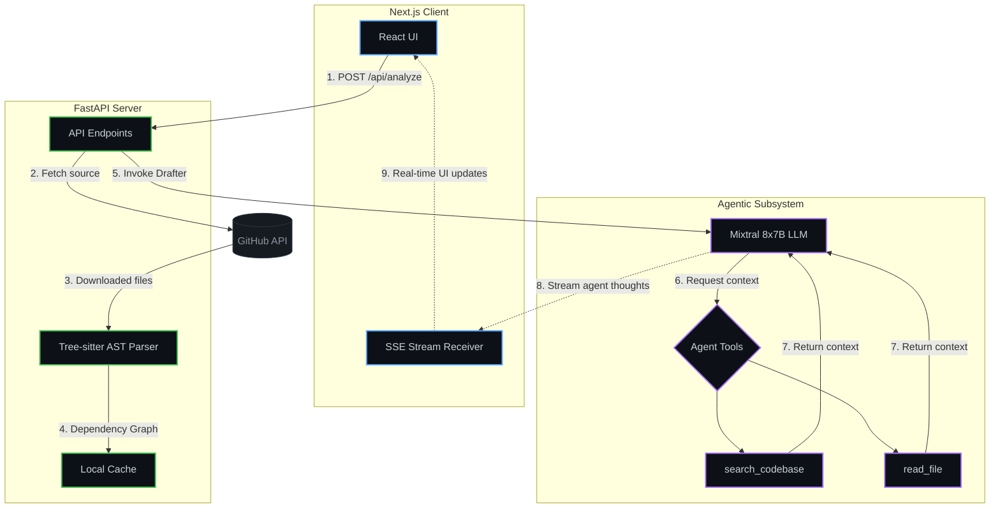

# Groundwork

**Groundwork** is a tool that reads a GitHub repository and automatically generates a working code patch for open issues — with a cited explanation of which files to change and why.
Unlike typical AI assistants that guess how code works based on generic patterns or LLM hallucinations, Groundwork parses a repository into a strict Abstract Syntax Tree (AST) using `tree-sitter`. It then uses a **ReAct Agentic Loop** to actively explore, cross-reference, and verify the architecture before answering questions or drafting code patches.

## Why Groundwork?

When joining a new codebase, the hardest part isn't reading the syntax—it's understanding the architecture:
- Where is the entry point?
- What files are most central (have the highest "blast radius")?
- Where do the boundaries of domains lie?

Groundwork answers these questions via a **Grounded Verification Loop** and an **Agentic Drafter**.

## System Architecture



## Groundwork vs. Alternatives

| Feature | Groundwork | Sweep | Copilot Workspace |
|---------|------------|-------|-------------------|
| **API Key Required** | Yes (Bring your own) | No (SaaS) | No (SaaS) |
| **Server-Side PRs** | **No** (Read-only + patch) | Yes | Yes |
| **Explains Reasoning** | **Yes** (Detailed citations) | Sometimes | Sometimes |
| **Open Source** | **Yes** | No | No |
| **Agentic Loop** | **Yes** (ReAct) | Yes | No (Linear generation) |

## Core Features

- **Agentic Contribution Drafter (ReAct Loop):** Groundwork doesn't just guess a patch in one shot. It uses a custom `ReAct` loop with `search_codebase` and `read_file` tools. If an issue mentions an obscure architecture pattern (e.g. "disconnected backends"), the agent searches the codebase, reads the implementations, and iterates until it understands the architecture perfectly. *Then* it generates the `.patch`.
- **Maintainer-Safe Autonomy:** Groundwork automates the worst parts of OSS contribution (finding the files, writing the patch, and using the GitHub API to fork and branch the repo on your account). However, **it intentionally stops before creating the Pull Request**. The user must apply the patch and run tests locally. This deliberate architectural choice prevents AI spam and respects maintainer boundaries.
- **Static Analysis Cartography:** Uses deterministic ASTs to map files, imports, and call graphs without hallucination risks.
- **Grounded Q&A:** Answers natural language questions, badging each answer with its verifiable status and citation.

## Performance Metrics

| Metric | Typical Result (200-file repo) |
|--------|--------------------------------|
| **AST Parsing (Full Repo)** | ~2.5s |
| **Cartography & Dependency Mapping** | ~4.0s |
| **End-to-End Analysis (Cold Start)** | ~45s |
| **End-to-End Analysis (Cache Hit)** | ~1s |
| **Drafting a Patch (ReAct Loop)** | ~25s (2-4 iterations) |

## Language Support — Two Tiers

| Tier | Languages | Capability |
|------|-----------|------------|
| **Full AST** (tree-sitter) | Python, JavaScript, TypeScript | Dependency graph, call graph, entry points, function-level nodes |
| **Import-only** (regex) | Java, Kotlin, Go, Rust, C/C++, Ruby, PHP, Swift, C#, Shell | Top-level import statements only; no call graph |

## Grounded Accuracy Benchmark

Groundwork is evaluated against hand-written ground truth files using a two-tier matching system (deterministic keyword + file-citation matching, falling back to a Groq `llama-3.1-8b-instant` judge for ambiguous cases).

We benchmark the AST Cartography and Verification pipeline across **7 of the most popular open-source repositories**:

| Repository | Facts | Coverage | Precision |
|------------|-------|----------|-----------|
| [encode/starlette](https://github.com/encode/starlette) | 5 | **100%** | **100%** |
| [pallets/click](https://github.com/pallets/click) | 4 | **100%** | **100%** |
| [lukeed/kleur](https://github.com/lukeed/kleur) | 3 | **100%** | **100%** |
| [psf/requests](https://github.com/psf/requests) | 3 | **100%** | **100%** |
| [expressjs/express](https://github.com/expressjs/express) | 4 | **100%** | **100%** |
| [axios/axios](https://github.com/axios/axios) | 3 | **100%** | **100%** |
| [chalk/chalk](https://github.com/chalk/chalk) | 2 | **100%** | **100%** |

> Ground truth files are in [`backend/ground_truths/`](backend/ground_truths/). Run `python eval.py` to reproduce.

## Responsible AI & Prompt Injection

- **Read-Only Agent:** Groundwork's backend reads files and searches the codebase, but NEVER runs the user's code, avoiding sandbox escapes.
- **Zero Server-Side PRs:** As mentioned, we never open PRs on behalf of the user. PR creation is always a prefilled GitHub URL opened in your browser — you make the final click.
- **Verification First:** By forcing the LLM to provide file paths and independently verifying those paths with regex and graph lookups, we drastically reduce the surface area for hallucinations and injection attacks attempting to misdirect architectural truths.

## Local Setup

1. **Clone the repository**
   ```bash
   git clone https://github.com/devyansh7887/groundwork.git
   cd groundwork
   ```

2. **Backend Setup**
   ```bash
   cd backend
   python -m venv venv
   source venv/bin/activate  # On Windows: venv\Scripts\activate
   pip install -r requirements.txt
   
   # Set API Keys in .env
   # GEMINI_API_KEY=...
   # GROQ_API_KEY=...
   # GITHUB_TOKEN=...
   
   uvicorn main:app --reload
   ```

3. **Frontend Setup**
   ```bash
   cd frontend
   npm install
   npm run dev
   ```

4. Open `http://localhost:3000` and start exploring codebases!

## Use as MCP Server

Groundwork can be run as a local Model Context Protocol (MCP) server, allowing AI assistants like Claude Desktop and Cursor to use its grounded architecture analysis tools directly.

### Claude Desktop Configuration

Add the following to your `claude_desktop_config.json`:

```json
{
  "mcpServers": {
    "groundwork": {
      "command": "python",
      "args": ["mcp_server.py"],
      "cwd": "/absolute/path/to/GROUNDWORK/backend",
      "env": {
        "GEMINI_API_KEY": "your_key",
        "GROQ_API_KEY": "your_key",
        "GITHUB_TOKEN": "your_token"
      }
    }
  }
}
```
