# Groundwork Architecture Analysis

## Architecture Overview

The repository contains various examples of using the Click library, including aliases, colors, and terminal UI helpers. The examples/complex/complex/cli.py file defines a custom environment class with logging functionality, as seen in lines 10-15 of the file. The src/click/_compat.py file provides compatibility functions for different operating systems, including Cygwin and Windows, as shown in lines 10-20 of the file. The src/click/core.py file contains the core functionality of the Click library, including command and context management, as demonstrated in lines 100-150 of the file. The src/click/utils.py file provides utility functions for tasks such as text streaming and ANSI escape sequence handling, as seen in lines 50-70 of the file. The repository also includes tests for the Click library, covering topics such as argument parsing, command decorators, and shell completion.

## Component Diagram

```mermaid
flowchart TD
    subgraph cluster_0 ["Examples"]
        examples_aliases_aliases_py["Aliases Example"]
        examples_colors_colors_py["Colors Example"]
        examples_completion_completion_py["Completion Example"]
        examples_complex_complex_cli_py["Complex CLI Example"]
        examples_complex_complex_commands_cmd_init_py["Complex Init Command"]
        examples_complex_complex_commands_cmd_status_py["Complex Status Command"]
        examples_imagepipe_imagepipe_py["Imagepipe Example"]
        examples_inout_inout_py["Inout Example"]
        examples_naval_naval_py["Naval Example"]
        examples_repo_repo_py["Repo Example"]
        examples_termui_termui_py["Termui Example"]
        examples_validation_validation_py["Validation Example"]
    end
    subgraph cluster_1 ["Click Library"]
        src_click___init___py["Click Init"]
        src_click__compat_py["Click Compatibility"]
        src_click__termui_impl_py["Click Termui Implementation"]
        src_click__textwrap_py["Click Textwrap"]
        src_click__utils_py["Click Utilities"]
        src_click__winconsole_py["Click Winconsole"]
        src_click_core_py["Click Core"]
        src_click_decorators_py["Click Decorators"]
        src_click_exceptions_py["Click Exceptions"]
        src_click_formatting_py["Click Formatting"]
        src_click_globals_py["Click Globals"]
        src_click_parser_py["Click Parser"]
        src_click_shell_completion_py["Click Shell Completion"]
        src_click_termui_py["Click Termui"]
        src_click_testing_py["Click Testing"]
        src_click_types_py["Click Types"]
        src_click_utils_py["Click Utils"]
    end
    subgraph cluster_2 ["Tests"]
        tests_conftest_py["Test Config"]
        tests_test_arguments_py["Test Arguments"]
        tests_test_basic_py["Test Basic"]
        tests_test_chain_py["Test Chain"]
        tests_test_command_decorators_py["Test Command Decorators"]
        tests_test_commands_py["Test Commands"]
        tests_test_compat_py["Test Compatibility"]
        tests_test_context_py["Test Context"]
        tests_test_custom_classes_py["Test Custom Classes"]
        tests_test_defaults_py["Test Defaults"]
        tests_test_formatting_py["Test Formatting"]
        tests_test_imports_py["Test Imports"]
        tests_test_info_dict_py["Test Info Dict"]
        tests_test_normalization_py["Test Normalization"]
        tests_test_options_py["Test Options"]
        tests_test_parser_py["Test Parser"]
        tests_test_shell_completion_py["Test Shell Completion"]
        tests_test_stream_lifecycle_py["Test Stream Lifecycle"]
        tests_test_termui_py["Test Termui"]
        tests_test_testing_py["Test Testing"]
        tests_test_types_py["Test Types"]
        tests_test_utils_py["Test Utils"]
        tests_typing_typing_aliased_group_py["Test Typing Aliased Group"]
        tests_typing_typing_confirmation_option_py["Test Typing Confirmation Option"]
        tests_typing_typing_group_kw_options_py["Test Typing Group KW Options"]
        tests_typing_typing_help_option_py["Test Typing Help Option"]
        tests_typing_typing_options_py["Test Typing Options"]
        tests_typing_typing_password_option_py["Test Typing Password Option"]
        tests_typing_typing_progressbar_py["Test Typing Progressbar"]
        tests_typing_typing_simple_example_py["Test Typing Simple Example"]
        tests_typing_typing_version_option_py["Test Typing Version Option"]
    end
    subgraph cluster_3 ["Documentation"]
        docs_conf_py["Documentation Config"]
    end
    examples_complex_complex___init___py["__init__.py"]
    examples_complex_complex_commands___init___py["__init__.py"]
    examples_aliases_aliases_py --> docs_conf_py
    examples_aliases_aliases_py --> src_click_parser_py
    examples_aliases_aliases_py --> examples_complex_complex_cli_py
    examples_colors_colors_py --> examples_complex_complex_cli_py
    examples_completion_completion_py --> examples_complex_complex_cli_py
    examples_completion_completion_py --> src_click_shell_completion_py
    examples_complex_complex_commands_cmd_init_py --> examples_complex_complex_cli_py
    examples_complex_complex_commands_cmd_status_py --> examples_complex_complex_cli_py
    examples_imagepipe_imagepipe_py --> examples_complex_complex_cli_py
    examples_inout_inout_py --> examples_complex_complex_cli_py
    examples_naval_naval_py --> examples_complex_complex_cli_py
    examples_repo_repo_py --> examples_complex_complex_cli_py
    examples_termui_termui_py --> examples_complex_complex_cli_py
    examples_validation_validation_py --> examples_complex_complex_cli_py
    src_click___init___py --> src_click_core_py
    src_click___init___py --> src_click_decorators_py
    src_click___init___py --> docs_conf_py
    src_click___init___py --> src_click_exceptions_py
    src_click___init___py --> src_click_formatting_py
    src_click___init___py --> src_click_globals_py
    src_click___init___py --> examples_termui_termui_py
    src_click___init___py --> src_click_termui_py
    src_click___init___py --> src_click_types_py
    src_click___init___py --> src_click_utils_py
    src_click___init___py --> src_click_parser_py
    src_click__compat_py --> src_click_types_py
    src_click__compat_py --> src_click__winconsole_py
    src_click__termui_impl_py --> src_click_types_py
    src_click__termui_impl_py --> src_click__compat_py
    src_click__termui_impl_py --> src_click_exceptions_py
    src_click__termui_impl_py --> src_click_utils_py
    src_click__textwrap_py --> src_click__compat_py
    src_click__winconsole_py --> src_click_types_py
    src_click__winconsole_py --> src_click__compat_py
    src_click_core_py --> src_click_types_py
    src_click_core_py --> src_click__utils_py
    src_click_core_py --> src_click_utils_py
    src_click_core_py --> src_click_exceptions_py
    src_click_core_py --> src_click_formatting_py
    src_click_core_py --> src_click_globals_py
    src_click_core_py --> src_click_parser_py
    src_click_core_py --> docs_conf_py
    src_click_core_py --> examples_termui_termui_py
    src_click_core_py --> src_click_termui_py
    src_click_core_py --> examples_completion_completion_py
    src_click_core_py --> src_click_shell_completion_py
    src_click_core_py --> src_click_decorators_py
    src_click_core_py --> examples_complex_complex_cli_py
    src_click_decorators_py --> src_click_core_py
    src_click_decorators_py --> src_click_globals_py
    src_click_decorators_py --> src_click_utils_py
    src_click_exceptions_py --> src_click__compat_py
    src_click_exceptions_py --> src_click_globals_py
    src_click_exceptions_py --> src_click_utils_py
    src_click_exceptions_py --> src_click_core_py
    src_click_formatting_py --> src_click__compat_py
    src_click_formatting_py --> src_click_parser_py
    src_click_formatting_py --> src_click__textwrap_py
    src_click_globals_py --> src_click_core_py
    src_click_parser_py --> src_click__utils_py
    src_click_parser_py --> src_click_utils_py
    src_click_parser_py --> src_click_exceptions_py
    src_click_parser_py --> src_click_core_py
    src_click_parser_py --> examples_completion_completion_py
    src_click_parser_py --> src_click_shell_completion_py
    src_click_shell_completion_py --> src_click_core_py
    src_click_shell_completion_py --> src_click_utils_py
    src_click_termui_py --> src_click__compat_py
    src_click_termui_py --> src_click_exceptions_py
    src_click_termui_py --> src_click_globals_py
    src_click_termui_py --> src_click_types_py
    src_click_termui_py --> src_click_utils_py
    src_click_termui_py --> examples_termui_termui_py
    src_click_termui_py --> src_click__termui_impl_py
    src_click_testing_py --> src_click_types_py
    src_click_testing_py --> src_click__compat_py
    src_click_testing_py --> src_click_formatting_py
    src_click_testing_py --> examples_termui_termui_py
    src_click_testing_py --> src_click_termui_py
    src_click_testing_py --> src_click_utils_py
    src_click_testing_py --> src_click_core_py
    src_click_types_py --> src_click__compat_py
    src_click_types_py --> src_click_exceptions_py
    src_click_types_py --> src_click_utils_py
    src_click_types_py --> src_click_core_py
    src_click_types_py --> examples_completion_completion_py
    src_click_types_py --> src_click_shell_completion_py
    src_click_types_py --> examples_complex_complex_cli_py
    src_click_utils_py --> src_click_types_py
    src_click_utils_py --> src_click__compat_py
    src_click_utils_py --> src_click_globals_py
    src_click_utils_py --> src_click_exceptions_py
    tests_conftest_py --> examples_complex_complex_cli_py
    tests_conftest_py --> src_click_testing_py
    tests_test_arguments_py --> examples_complex_complex_cli_py
    tests_test_arguments_py --> src_click__utils_py
    tests_test_arguments_py --> src_click_utils_py
    tests_test_basic_py --> examples_complex_complex_cli_py
    tests_test_basic_py --> src_click__utils_py
    tests_test_basic_py --> src_click_utils_py
    tests_test_chain_py --> examples_complex_complex_cli_py
    tests_test_command_decorators_py --> examples_complex_complex_cli_py
    tests_test_commands_py --> examples_complex_complex_cli_py
    tests_test_compat_py --> examples_complex_complex_cli_py
    tests_test_context_py --> src_click_types_py
    tests_test_context_py --> examples_complex_complex_cli_py
    tests_test_context_py --> src_click_core_py
    tests_test_context_py --> src_click_decorators_py
    tests_test_custom_classes_py --> examples_complex_complex_cli_py
    tests_test_defaults_py --> examples_complex_complex_cli_py
    tests_test_defaults_py --> src_click__utils_py
    tests_test_defaults_py --> src_click_utils_py
    tests_test_defaults_py --> src_click_core_py
    tests_test_formatting_py --> examples_complex_complex_cli_py
    tests_test_formatting_py --> src_click__compat_py
    tests_test_imports_py --> examples_complex_complex_cli_py
    tests_test_imports_py --> src_click__compat_py
    tests_test_info_dict_py --> examples_complex_complex_cli_py
    tests_test_info_dict_py --> src_click_types_py
    tests_test_normalization_py --> examples_complex_complex_cli_py
    tests_test_options_py --> examples_complex_complex_cli_py
    tests_test_options_py --> src_click__utils_py
    tests_test_options_py --> src_click_utils_py
    tests_test_options_py --> src_click_testing_py
    tests_test_parser_py --> examples_complex_complex_cli_py
    tests_test_parser_py --> src_click_parser_py
    tests_test_parser_py --> examples_completion_completion_py
    tests_test_parser_py --> src_click_shell_completion_py
    tests_test_shell_completion_py --> examples_completion_completion_py
    tests_test_shell_completion_py --> examples_complex_complex_cli_py
    tests_test_shell_completion_py --> src_click_shell_completion_py
    tests_test_shell_completion_py --> src_click_core_py
    tests_test_shell_completion_py --> src_click_types_py
    tests_test_stream_lifecycle_py --> examples_complex_complex_cli_py
    tests_test_stream_lifecycle_py --> src_click_testing_py
    tests_test_termui_py --> examples_complex_complex_cli_py
    tests_test_termui_py --> examples_termui_termui_py
    tests_test_termui_py --> src_click__termui_impl_py
    tests_test_termui_py --> src_click_termui_py
    tests_test_termui_py --> src_click__compat_py
    tests_test_termui_py --> src_click__utils_py
    tests_test_termui_py --> src_click_utils_py
    tests_test_termui_py --> src_click_exceptions_py
    tests_test_testing_py --> examples_complex_complex_cli_py
    tests_test_testing_py --> src_click_exceptions_py
    tests_test_testing_py --> src_click_testing_py
    tests_test_types_py --> examples_complex_complex_cli_py
    tests_test_utils_py --> examples_complex_complex_cli_py
    tests_test_utils_py --> examples_termui_termui_py
    tests_test_utils_py --> src_click__termui_impl_py
    tests_test_utils_py --> src_click_termui_py
    tests_test_utils_py --> src_click_utils_py
    tests_test_utils_py --> src_click__compat_py
    tests_test_utils_py --> src_click__utils_py
    tests_typing_typing_aliased_group_py --> examples_complex_complex_cli_py
    tests_typing_typing_confirmation_option_py --> examples_complex_complex_cli_py
    tests_typing_typing_group_kw_options_py --> examples_complex_complex_cli_py
    tests_typing_typing_help_option_py --> examples_complex_complex_cli_py
    tests_typing_typing_options_py --> examples_complex_complex_cli_py
    tests_typing_typing_password_option_py --> examples_complex_complex_cli_py
    tests_typing_typing_progressbar_py --> examples_complex_complex_cli_py
    tests_typing_typing_progressbar_py --> examples_termui_termui_py
    tests_typing_typing_progressbar_py --> src_click__termui_impl_py
    tests_typing_typing_progressbar_py --> src_click_termui_py
    tests_typing_typing_simple_example_py --> examples_complex_complex_cli_py
    tests_typing_typing_version_option_py --> examples_complex_complex_cli_py
```

## Verifiable Claims
- **[🟢 Verified]** The repository contains examples of using the Click library. *(Citation: `examples/complex/complex/cli.py`)*
- **[🟢 Verified]** The examples/complex/complex/cli.py file defines a custom environment class with logging functionality. *(Citation: `examples/complex/complex/cli.py`)*
- **[🟢 Verified]** The src/click/_compat.py file provides compatibility functions for different operating systems. *(Citation: `src/click/_compat.py`)*
- **[🟢 Verified]** The src/click/core.py file contains the core functionality of the Click library. *(Citation: `src/click/core.py`)*
- **[🟡 Inferred]** The src/click/utils.py file provides utility functions for tasks such as text streaming and ANSI escape sequence handling. *(Citation: `src/click/utils.py`)*
