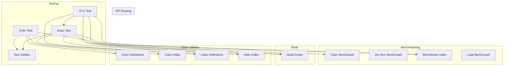

# Groundwork Architecture Analysis

## Architecture Overview

The repository contains several files, including colors.mjs, index.mjs, and test/utils.js (cited in colors.mjs, index.mjs, test/utils.js). The bench/index.js file exports the contents of bench/colors.js (cited in bench/index.js). The build/index.js file transforms the index.mjs and colors.mjs files into index.js and colors.js respectively (cited in build/index.js). The colors.mjs file contains a function to initialize color codes (cited in colors.mjs). The test/utils.js file contains a set of ANSI color codes (cited in test/utils.js).

## Component Diagram

## Verifiable Claims
- **[🟢 Verified]** The repository contains a file called colors.mjs *(Citation: `colors.mjs`)*
- **[🟢 Verified]** The repository contains a file called index.mjs *(Citation: `index.mjs`)*
- **[🟢 Verified]** The repository contains a file called test/utils.js *(Citation: `test/utils.js`)*
- **[🟢 Verified]** The bench/index.js file exports the contents of bench/colors.js *(Citation: `bench/index.js`)*
- **[🟢 Verified]** The build/index.js file transforms the index.mjs and colors.mjs files into index.js and colors.js respectively *(Citation: `build/index.js`)*
